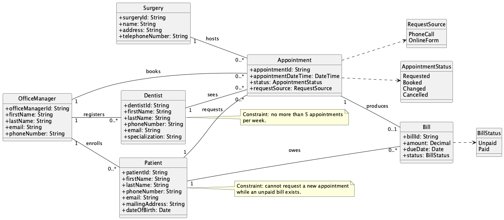

# Lab 3 - Requirements Discovery and Domain Modeling

## System
Advantis Dental Surgeries (ADS) web application for managing dental surgery operations.

## Task 1.1 - Functional Requirements (Requirements Discovery)
1. The system shall allow an Office Manager to register a Dentist.
2. The system shall assign and store a unique identifier for each Dentist.
3. The system shall store Dentist details: first name, last name, phone number, email, and specialization.
4. The system shall allow an Office Manager to enroll a new Patient.
5. The system shall store Patient details: first name, last name, phone number, email, mailing address, and date of birth.
6. The system shall allow a Patient to request an appointment by phone call.
7. The system shall allow a Patient to request an appointment through an online form.
8. The system shall allow an Office Manager to book an appointment for a Patient.
9. The system shall record each booked appointment with its date/time, dentist, patient, and surgery location.
10. The system shall send a confirmation email to the Patient when an appointment is booked.
11. The system shall allow a Dentist to sign in and view all appointments assigned to that Dentist.
12. The system shall display Patient information to the Dentist for each appointment.
13. The system shall allow a Patient to sign in and view all appointments for that Patient.
14. The system shall display Dentist information to the Patient for each appointment.
15. The system shall allow a Patient to request cancellation of an appointment.
16. The system shall allow a Patient to request a change/reschedule of an appointment.
17. The system shall store Surgery information including name, address, and telephone number.
18. The system shall enforce that one appointment is scheduled at exactly one surgery location.
19. The system shall prevent assigning more than five appointments to the same Dentist within any given week.
20. The system shall block a new appointment request when a Patient has an outstanding unpaid bill.

## Business Rules
- A Dentist can have a maximum of 5 appointments in a given week.
- A Patient with an unpaid bill cannot request a new appointment.
- Each Appointment must be associated with one Dentist, one Patient, and one Surgery location.

## Task 1.2 - Domain Model UML Diagram
The domain model UML Diagram is:

