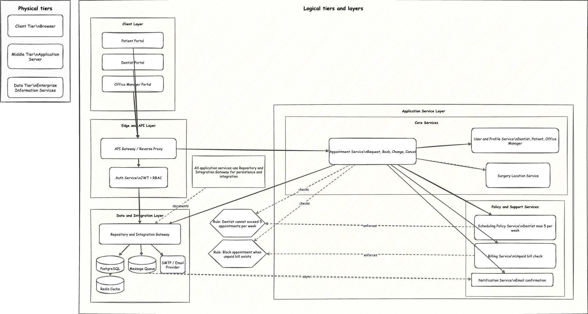

# Lab 4 - ADS Software Solution Architecture

## Objective
Create a system architecture diagram for the ADS (Advantis Dental Surgeries) web solution and choose a tech stack.

## Chosen Tech Stack
- Frontend: React + TypeScript
- Backend: Java 21 + Spring Boot
- API Security: JWT-based authentication with role-based access control (RBAC)
- Database: PostgreSQL
- Cache: Redis
- Async Messaging: RabbitMQ (or similar queue)
- Email: SMTP provider (for appointment confirmations)
- CI/CD: GitHub Actions
- Deployment: Docker containers (Nginx + Spring Boot services)

## Architecture Diagram

This diagram includes:
- Client layer (Office Manager, Dentist, Patient portals)
- API/Edge layer (gateway + auth)
- Service layer (appointments, billing, scheduling policy, user profiles, surgeries, notifications)
- Data/integration layer (PostgreSQL, Redis, queue, SMTP)
- Required business constraints