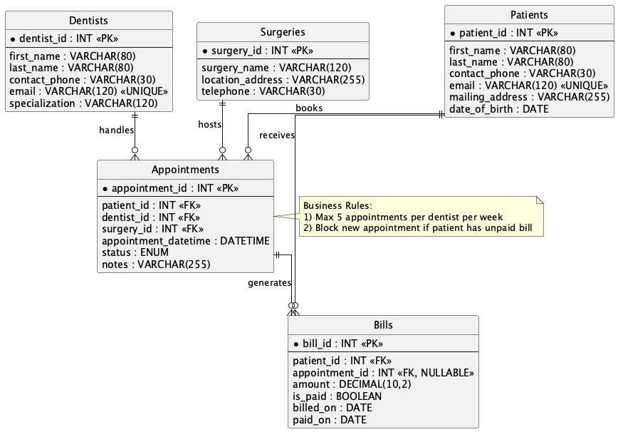
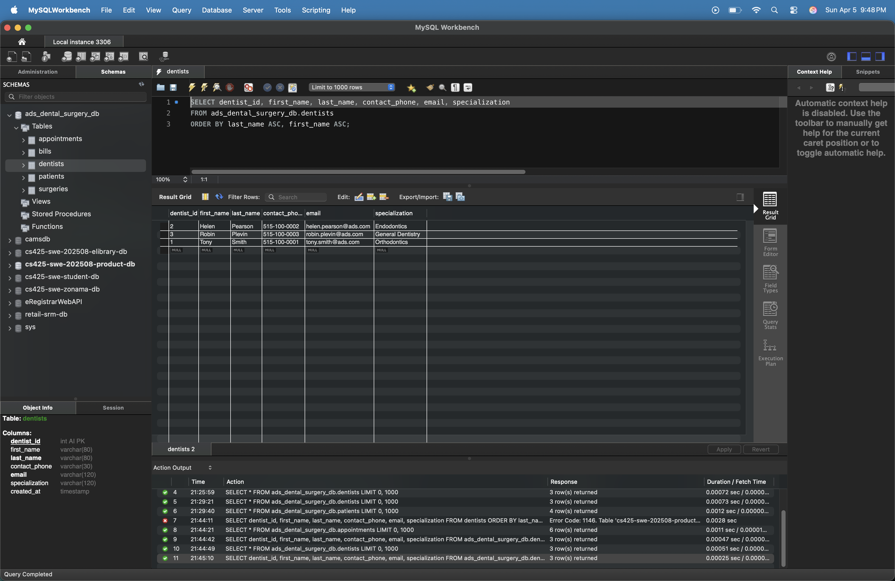
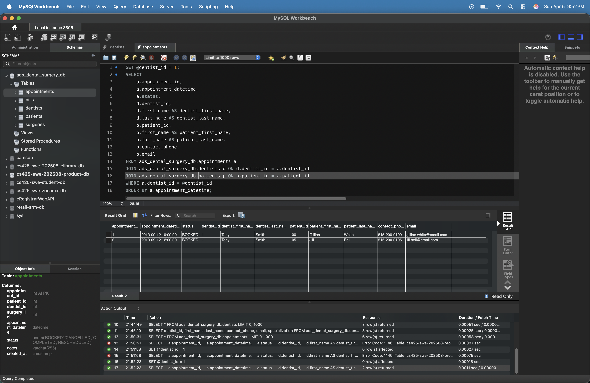
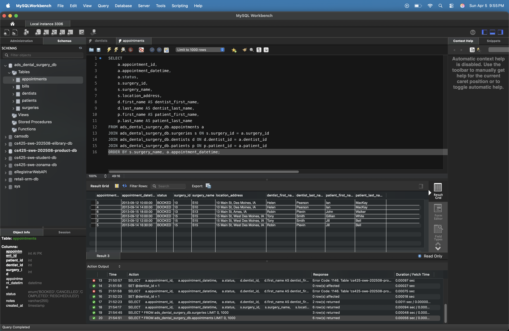
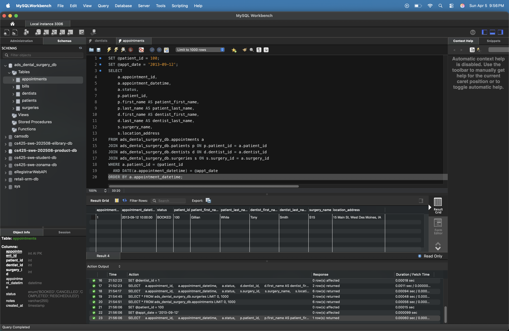

# Lab 5a - Data Modeling, Database Design and Implementation (ADS)

This lab implements the ADS (Advantis Dental Surgeries) relational database design based on the Lab 3 problem statement.

## Objective

- Create an ER model for the ADS system
- Implement the physical relational database schema
- Populate the database with dummy data
- Write and execute required SQL queries
- Capture query output screenshots

## Tech Stack

- MySQL 8.x
- SQL

## Repository Contents

- `ads-er-diagram.png` - ER diagram image
- `myADSDentalSurgeryDBScript.sql` - complete SQL script:
  - database creation
  - table definitions and constraints
  - trigger-based business rules
  - dummy data inserts
  - required lab queries
- `screenshots/` - query execution evidence

## Database Scope

The schema models the following entities:

- Dentists
- Patients
- Surgeries
- Appointments
- Bills

### Implemented Business Rules

1. A dentist cannot have more than 5 appointments in a given week.
2. A patient with outstanding unpaid bills cannot book a new appointment.

Both rules are enforced using a `BEFORE INSERT` trigger on `appointments`.

## How to Run

1. Open MySQL client (CLI or Workbench).
2. Run the script:

```sql
SOURCE myADSDentalSurgeryDBScript.sql;
```

Alternative from terminal:

```bash
mysql -u <username> -p < myADSDentalSurgeryDBScript.sql
```

## ER Diagram

ADS Dental Surgery ER Diagram


## Required Queries Included with Screenshots

The script includes all required queries:

1. List all dentists sorted by last name (ascending)


2. List all appointments for a given dentist (including patient information)


3. List all appointments scheduled at a surgery location


4. List appointments for a given patient on a given date


## Notes

- The SQL script is idempotent for setup via `DROP DATABASE IF EXISTS` followed by fresh creation.
- Parameterized variables are used in Query 2 and Query 4 (`@dentist_id`, `@patient_id`, `@appt_date`) for easy testing.
