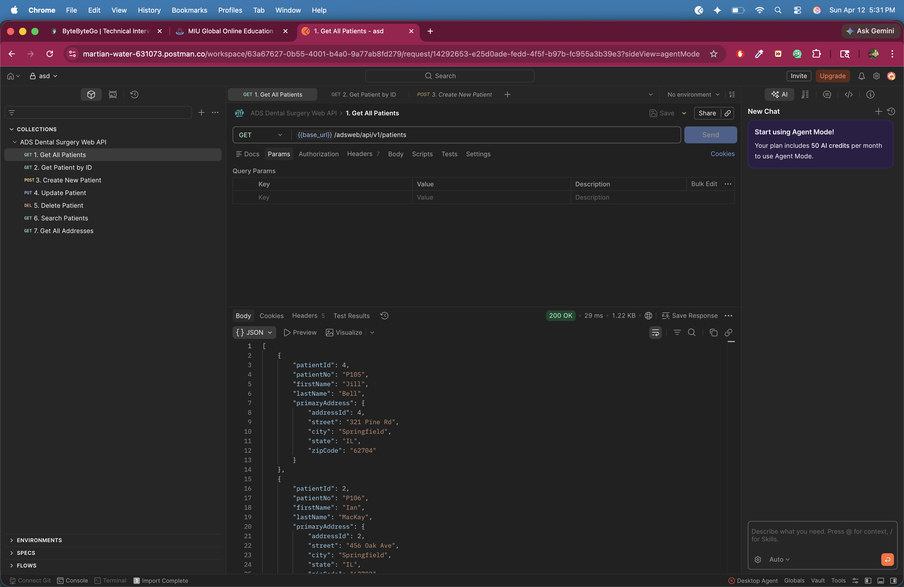
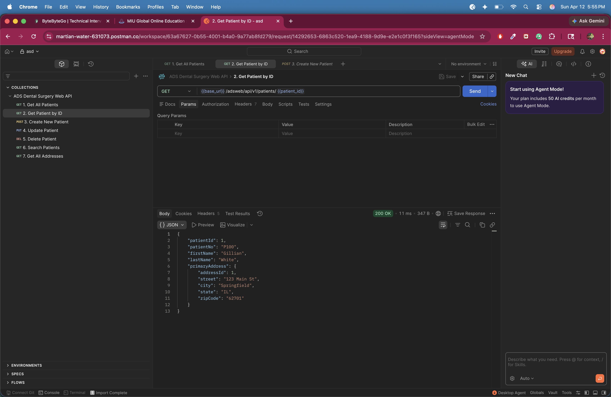
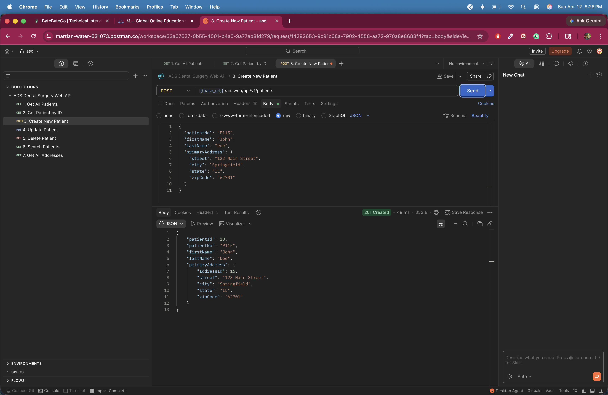
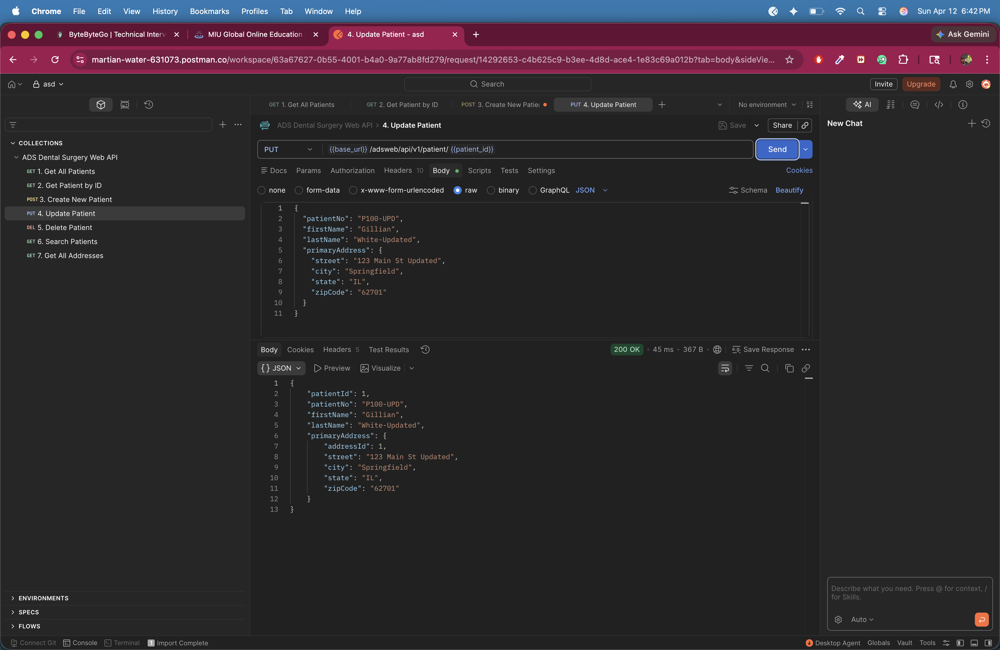
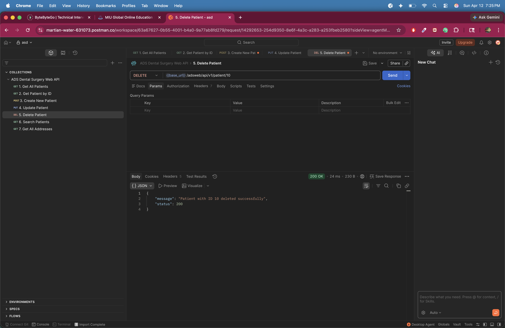
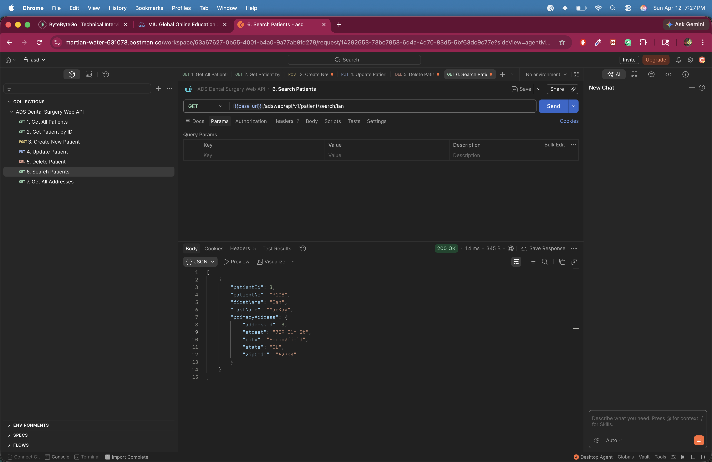
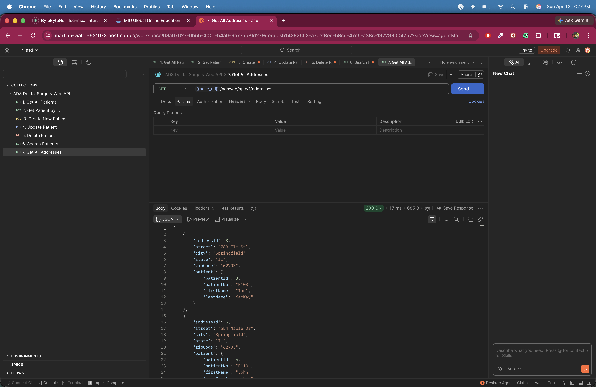

# ADS Dental Surgery Appointments Management Web API

This project is a Spring Boot RESTful Web API for the ADS Dental Surgeries Appointments Management System. It provides patient and address operations with validation, sorting, search support, and exception handling.

## Project Details

- Backend: Spring Boot 3.1.4, Spring Web MVC, Spring Data JPA
- Database: MySQL
- Language: Java 21
- Build Tool: Maven
- Base URL: http://localhost:8080/adsweb/api/v1

## Main Implementation Highlights

- Layered architecture using controller, service, and repository layers
- DTO-based request/response payloads for cleaner API contracts
- Global exception handling for 404, 400, and 409 responses
- Patient duplicate number protection during create/update
- Safe patient delete logic that handles related appointment records
- Data initialization for sample records at startup

## How To Run

From this project directory:

```bash
mvn clean package -DskipTests
java -jar target/adswebapi-0.0.1-SNAPSHOT.jar
```

## API Endpoints With Screenshots

### 1. Get all patients

- Method: GET
- URL: /patients
- Description: Returns all patients sorted by `lastName` ascending, including primary address.



### 2. Get patient by ID

- Method: GET
- URL: /patients/{patientId}
- Description: Returns a single patient by ID. If not found, returns 404.



### 3. Create patient

- Method: POST
- URL: /patients
- Description: Registers a new patient with primary address. Duplicate `patientNo` returns 409 Conflict.



### 4. Update patient

- Method: PUT
- URL: /patient/{patientId}
- Description: Updates patient and address details for the given patient ID.



### 5. Delete patient

- Method: DELETE
- URL: /patient/{patientId}
- Description: Deletes a patient and returns a JSON success message.



### 6. Search patients

- Method: GET
- URL: /patient/search/{searchString}
- Description: Performs text search across patient and address fields.



### 7. Get all addresses

- Method: GET
- URL: /addresses
- Description: Returns all addresses sorted by city with patient summary data.



## Endpoint Summary

| # | Method | Endpoint | Purpose |
|---|--------|----------|---------|
| 1 | GET | /adsweb/api/v1/patients | List all patients (sorted by last name) |
| 2 | GET | /adsweb/api/v1/patients/{patientId} | Get patient by ID |
| 3 | POST | /adsweb/api/v1/patients | Register new patient |
| 4 | PUT | /adsweb/api/v1/patient/{patientId} | Update patient |
| 5 | DELETE | /adsweb/api/v1/patient/{patientId} | Delete patient |
| 6 | GET | /adsweb/api/v1/patient/search/{searchString} | Search patients |
| 7 | GET | /adsweb/api/v1/addresses | List all addresses (sorted by city) |