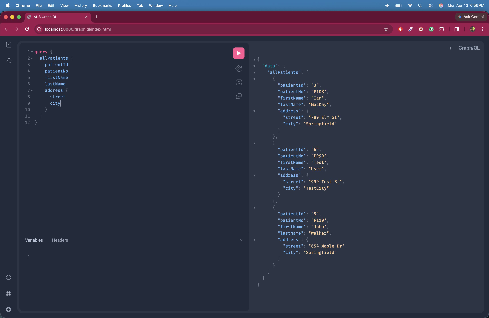
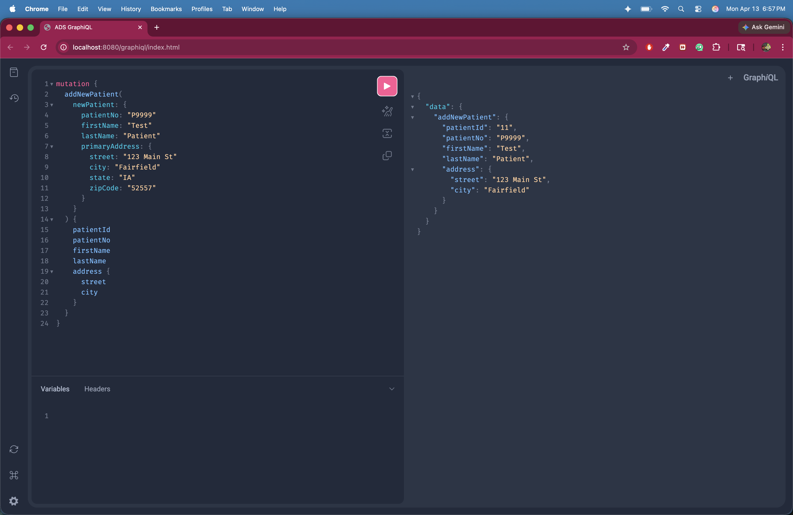
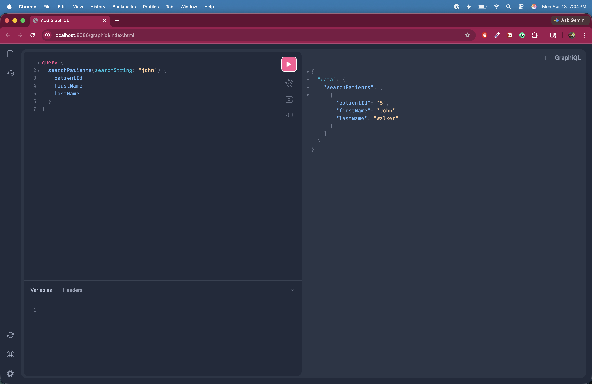

# ADS Dental Surgery Appointments GraphQL Web API (Lab 7b)

This project is the GraphQL version of the ADS Dental Surgery Appointments Web API.
It was adapted from the Lab 7 REST project and implemented using the CityLibrary GraphQL example as a guide.

## Tech Stack

- Spring Boot 3.1.4
- Spring GraphQL
- Spring Data JPA
- MySQL
- Java 21
- Maven

## Run Instructions

From this project directory:

```bash
mvn spring-boot:run
```

Application URLs:

- GraphQL endpoint: `http://localhost:8080/graphql`
- GraphiQL UI: `http://localhost:8080/graphiql`

## GraphQL Operations Implemented

### Queries

- `allPatients`: returns all patients sorted by last name
- `patientById(patientId: ID!)`: returns a patient by id
- `searchPatients(searchString: String!)`: searches patients by name/no/address text

### Mutations

- `addNewPatient(newPatient: NewPatient!)`: creates a new patient with address
- `updatePatient(patientId: ID!, newPatient: NewPatient!)`: updates patient and address
- `deletePatient(patientId: ID!)`: deletes patient by id

## Schema Files

- GraphQL schema: `src/main/resources/graphql/ads_schema.graphqls`
- GraphQL controller: `src/main/java/edu/miu/cs/cs489/lab6/adsappointment/controller/PatientGraphqlController.java`

## GraphiQL Test Screenshots

The required GraphiQL screenshots are stored in the `screenshots` folder.

### 1. All Patients Query

File: `screenshots/01-all-patients.png`



### 2. Add Patient Mutation

File: `screenshots/02-add-patient.png`



### 3. Search Patients Query

File: `screenshots/03-search-patients.png`

