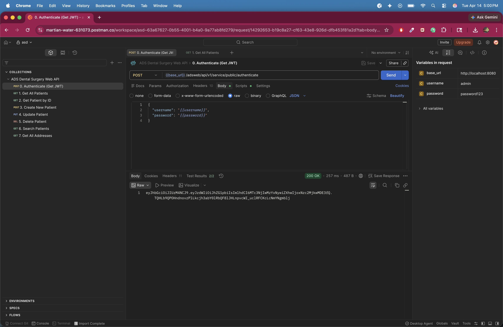
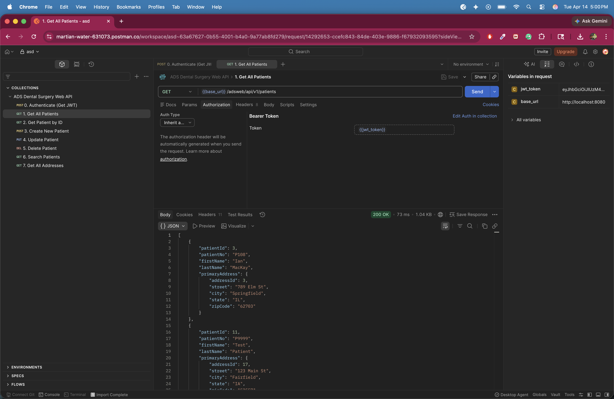
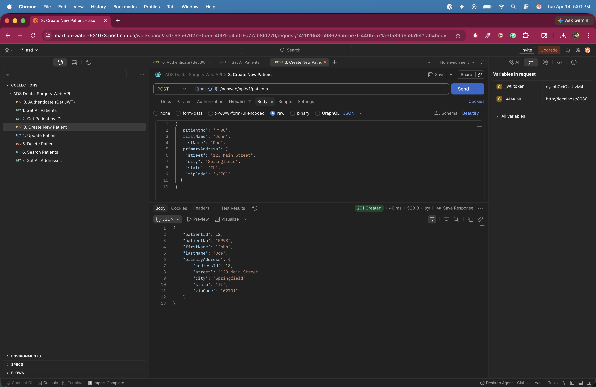
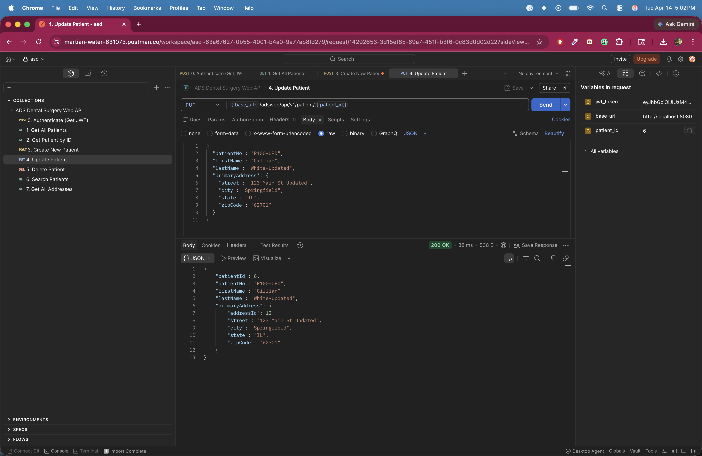
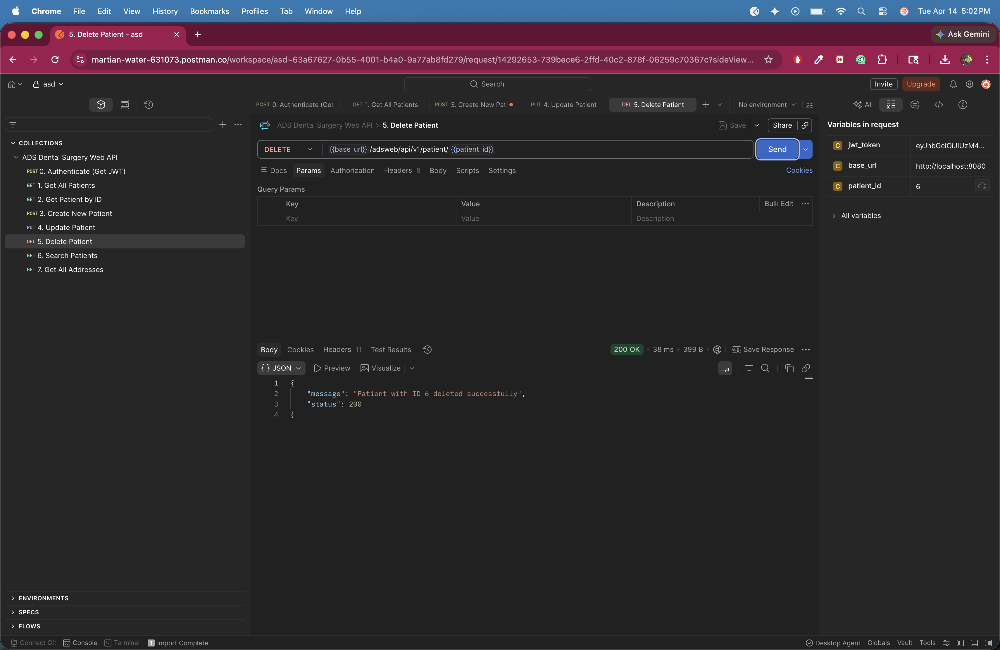

# ADS Dental Surgery Appointments Management Web API

This project is a Spring Boot RESTful Web API for the ADS Dental Surgeries Appointments Management System. It provides patient and address operations with validation, sorting, search support, exception handling, and JWT-based authentication.

## Project Details

- Backend: Spring Boot 3.1.4, Spring Web MVC, Spring Security, Spring Data JPA
- Database: MySQL
- Language: Java 21
- Build Tool: Maven
- Base URL: http://localhost:8080/adsweb/api/v1

## Main Implementation Highlights

- Layered architecture using controller, service, and repository layers
- DTO-based request/response payloads for cleaner API contracts
- JWT authentication with stateless Spring Security configuration
- Role-based authorization using `User` and `Role` entities
- Global exception handling for 404, 400, 401, and 409 responses
- Patient duplicate number protection during create/update
- Safe patient delete logic that handles related appointment records
- Data initialization for sample records at startup

## Authentication

Authenticate first to receive a JWT token:

- Method: POST
- URL: /adsweb/api/v1/service/public/authenticate
- Body:

```json
{
	"username": "admin",
	"password": "password123"
}
```

The response is a JWT token string. Include it in subsequent requests using:

```http
Authorization: Bearer <token>
```

Sample users created at startup:

- `admin` / `password123`
- `manager` / `password123`

## How To Run

From this project directory:

```bash
mvn clean package -DskipTests
java -jar target/adswebapi-0.0.1-SNAPSHOT.jar
```

## API Endpoints With Screenshots

### 1. Authenticate user and get JWT

- Method: POST
- URL: /adsweb/api/v1/service/public/authenticate
- Description: Returns a JWT token for a valid username and password.



### 2. Get all patients (with JWT token)

- Method: GET
- URL: /patients
- Description: Returns all patients sorted by `lastName` ascending, including primary address. Requires JWT token in Authorization header.



### 3. Create patient (with JWT token)

- Method: POST
- URL: /patients
- Description: Registers a new patient with primary address. Duplicate `patientNo` returns 409 Conflict. Requires OFFICE_MANAGER role.



### 4. Update patient (with JWT token)

- Method: PUT
- URL: /patient/{patientId}
- Description: Updates patient and address details for the given patient ID. Requires OFFICE_MANAGER role.



### 5. Delete patient (with JWT token)

- Method: DELETE
- URL: /patient/{patientId}
- Description: Deletes a patient and returns a JSON success message. Requires OFFICE_MANAGER role.



## Endpoint Summary

| # | Method | Endpoint | Purpose | Auth Required |
|---|--------|----------|---------|----------------|
| 1 | POST | /adsweb/api/v1/service/public/authenticate | Authenticate user and receive JWT | No |
| 2 | GET | /adsweb/api/v1/patients | List all patients (sorted by last name) | Yes |
| 3 | POST | /adsweb/api/v1/patients | Register new patient | Yes (OFFICE_MANAGER) |
| 4 | PUT | /adsweb/api/v1/patient/{patientId} | Update patient | Yes (OFFICE_MANAGER) |
| 5 | DELETE | /adsweb/api/v1/patient/{patientId} | Delete patient | Yes (OFFICE_MANAGER) |